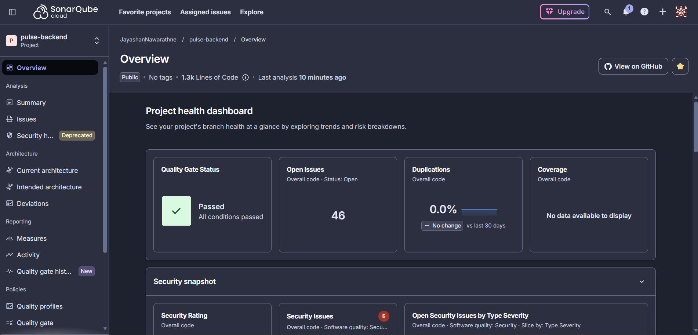

# Pulse API — NestJS Backend

[](https://sonarcloud.io/summary/new_code?id=Jayashan00_pulse-backend)

The REST API layer of **Pulse**, a TikTok-style social platform. NestJS is the only layer that talks to PostgreSQL (via Prisma) and Firebase (Authentication + Storage via the Admin SDK). The Next.js frontend consumes this API over HTTP.

**Live API:** `http://13.235.153.158/api`  

---

## Project Overview
Pulse API provides authentication, posts (with likes/saves/shares/comments), user profiles, media upload, notifications, and direct messages — all validated with DTOs + class-validator, rate-limited, and wrapped in centralized error handling.

## Features Implemented
- **Auth API** — sign-up, login, logout backed by **Firebase Authentication** (Admin SDK + Identity Toolkit); returns an ID token consumed by the frontend
- **Posts API** — full CRUD, cursor-paginated feed, like/save toggles, share counter, comments (create/list/delete), automatic like/comment **notifications**
- **Users API** — profile fetch/update, user search, per-user posts, saved posts
- **Upload API** — multipart upload to **Firebase Storage** (images/GIFs/short clips ≤ 25 MB), returns a public download URL
- **Notifications API** — list, unread count, mark-as-read (single + all)
- **Messages API** — conversations list with unread counts, thread fetch (auto-marks read), send (auto-creates conversation)
- **Hardening** — global ValidationPipe (whitelist + forbid unknown), `@nestjs/throttler` rate limiting (120 req/min), centralized exception filter, DB-level constraints (unique indexes, FKs with cascade, length limits)

## Technology Stack
NestJS 10 · TypeScript · Prisma ORM · PostgreSQL 16 · Firebase Admin SDK · Docker & docker-compose · PM2 (non-Docker option) · GitHub Actions + webhook auto-deploy

## PostgreSQL Data Model
| Table | Purpose | Key columns / constraints |
|---|---|---|
| `users` | Profiles linked to Firebase | `firebaseUid` UNIQUE, `email` UNIQUE, `username` UNIQUE |
| `posts` | Feed content | FK → users (CASCADE), `shareCount`, indexed on `createdAt` |
| `comments` | Post comments | FK → posts/users, 300-char limit |
| `likes` | Post likes | UNIQUE(`postId`,`userId`) — one like per user |
| `saves` | Bookmarks | UNIQUE(`postId`,`userId`) |
| `notifications` | Like/comment/system events | FK recipient + optional actor, indexed on (`userId`,`read`) |
| `conversations` | DM threads | UNIQUE(`userAId`,`userBId`) — one thread per pair |
| `messages` | DM messages | FK → conversation/sender, `read` flag |

Full schema: [`prisma/schema.prisma`](prisma/schema.prisma)

## NestJS Module Structure
```
src/
├── auth/            AuthModule — signup / login / logout (Firebase)
├── users/           UsersModule — profiles, search, saved posts
├── posts/           PostsModule — CRUD, feed, likes, saves, shares, comments
├── notifications/   NotificationsModule — list / unread / mark-read
├── messages/        MessagesModule — conversations & messages
├── upload/          UploadModule — media → Firebase Storage
├── firebase/        Firebase Admin SDK provider (global)
├── prisma/          PrismaService (global)
└── common/          FirebaseAuthGuard, @CurrentUser, AllExceptionsFilter
```

## API Endpoints (prefix `/api`)
| Method | Endpoint | Description |
|---|---|---|
| POST | `/auth/signup` | Create account (Firebase + Postgres) |
| POST | `/auth/login` | Email/password login → ID token |
| POST | `/auth/logout` | Revoke refresh tokens 🔒 |
| GET | `/posts/feed?cursor=&limit=` | Paginated feed 🔒 |
| POST / GET / PATCH / DELETE | `/posts`, `/posts/:id` | Post CRUD 🔒 |
| POST | `/posts/:id/like` · `/save` · `/share` | Interactions 🔒 |
| GET / POST | `/posts/:id/comments` | Comments 🔒 |
| DELETE | `/posts/comments/:commentId` | Delete own comment 🔒 |
| GET | `/users/search?q=` | Search users 🔒 |
| GET / PATCH | `/users/me` | My profile 🔒 |
| GET | `/users/me/saved` | Saved posts 🔒 |
| GET | `/users/:username` · `/:username/posts` | Public profile + posts 🔒 |
| GET | `/notifications` · `/unread-count` | Notifications 🔒 |
| PATCH | `/notifications/:id/read` · `/read-all` | Mark as read 🔒 |
| GET | `/messages/conversations` · `/conversations/:id` | DMs 🔒 |
| POST | `/messages` | Send message 🔒 |
| POST | `/upload?folder=posts|avatars` | Media upload (multipart `file`) 🔒 |

🔒 = requires `Authorization: Bearer <Firebase ID token>`

## Installation
```bash
git clone <this-repo> && cd pulse-backend
npm install
cp .env .env        # fill in every value (see below)
```

### Environment Variables (never commit `.env`)
| Variable | Where to get it |
|---|---|
| `DATABASE_URL` | Your Postgres connection string |
| `FIREBASE_PROJECT_ID`, `FIREBASE_CLIENT_EMAIL`, `FIREBASE_PRIVATE_KEY` | Firebase Console → Project Settings → **Service Accounts** → Generate new private key (paste key with `\n` escapes) |
| `FIREBASE_STORAGE_BUCKET` | Firebase Console → Storage (e.g. `myproj.appspot.com`) |
| `FIREBASE_WEB_API_KEY` | Firebase Console → Project Settings → General |
| `CORS_ORIGIN` | Frontend origin(s), comma-separated |

Also enable **Email/Password** sign-in in Firebase Console → Authentication → Sign-in method, and enable **Storage**.

## Run (local dev)
```bash
docker compose up -d postgres      # local PostgreSQL 16
npx prisma migrate dev             # create tables
npm run start:dev                  # API on http://localhost:4000/api
```
Or run the whole stack in Docker: `docker compose up --build`

## AWS EC2 Deployment
1. **Provision with Terraform** (see the `infrastructure/` repo/folder): `terraform apply` creates an Ubuntu 24.04 EC2 instance, security group (22/80/443/9000), and an Elastic IP; `user_data.sh` installs Docker, Node 20, PM2 and Nginx automatically.
2. **SSH in** and clone this repo to `~/apps/pulse-backend`, create `.env`.
3. **Start:** `docker compose -f docker-compose.prod.yml up -d --build` — runs Postgres + API (migrations apply automatically on boot).
4. **Nginx:** the provided `pulse.conf` proxies `/api → 127.0.0.1:4000`.
5. **Auto-deploy:** either the included **GitHub Actions** workflow (`.github/workflows/deploy.yml`, set `EC2_HOST` + `EC2_SSH_KEY` secrets) or the **GitHub webhook** listener (`infrastructure/webhook/`) — push to `main` redeploys automatically.
6. **Without Docker (PM2 alternative):** `npm run build && npx prisma migrate deploy && pm2 start ecosystem.config.js && pm2 save && pm2 startup`.

## Design Decisions
- **Prisma over TypeORM** — type-safe queries and painless migrations
- **Firebase ID token as the session** — stateless auth; the guard verifies tokens per request and hydrates the Postgres user
- **Cursor pagination** for the feed — stable under concurrent inserts, ideal for infinite scroll
- **Notifications written inside interaction flows** (like/comment) rather than a separate queue — right-sized for this scope
- **Unique compound indexes** (`likes`, `saves`, `conversations`) enforce integrity at the database layer, not just app code

## Future Improvements
WebSocket gateway for real-time DMs/notifications · follow system + personalized feed ranking · refresh-token rotation endpoint · S3/CloudFront media CDN · Redis cache for feed & unread counts · e2e tests with Testcontainers

## Code Quality
Static analysis runs on every push via SonarCloud + GitHub Actions. Quality gate: passing (0 open vulnerabilities in application code, A maintainability).


